# ImmunoChain -  Chain of Awareness and Immunization

## Problem Statement

This project the first prize award winning project that was developed as part of the EY Techathon 2021. Its a combined solution to the following two problem statements:

## 1. BlockChain

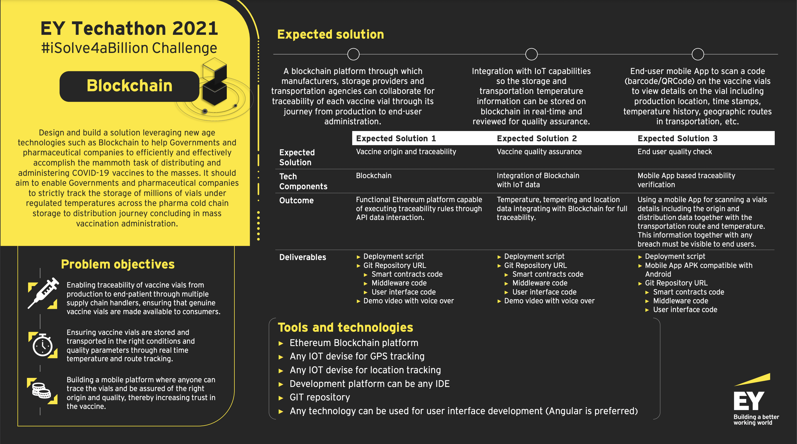

## 2. Gamification

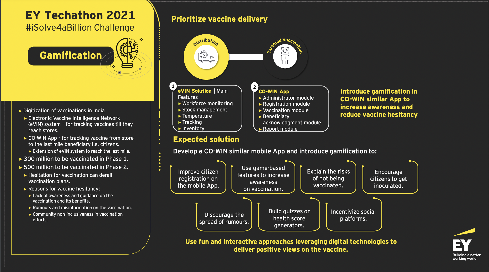
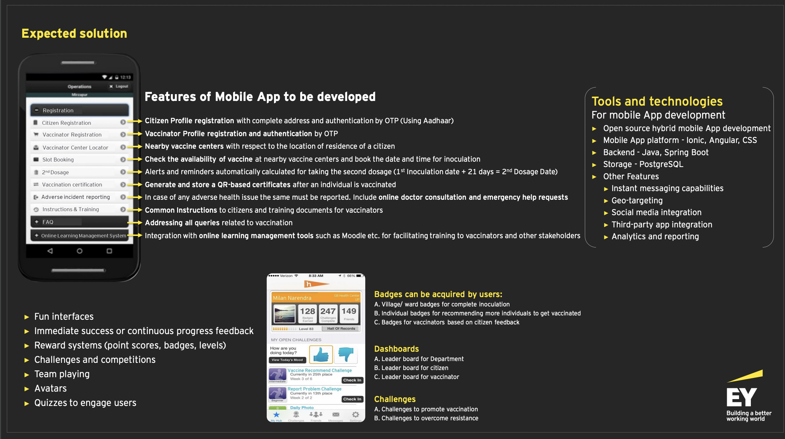

## Solution
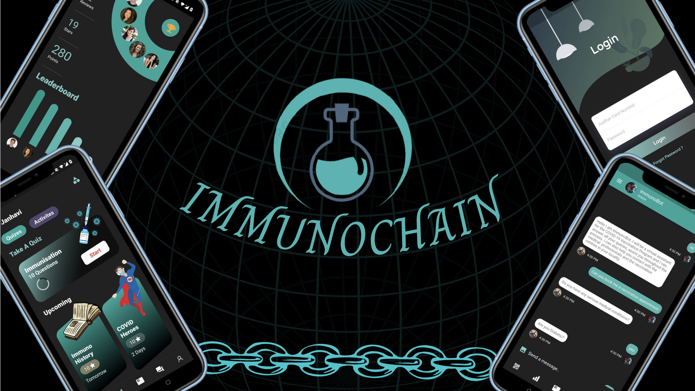

For a complete explanation of our project please watch the following video: https://drive.google.com/drive/folders/1nOWALjUvGpC_ozKkm4Z4h9cdK4QF6i8Z?usp=sharing

## Design

### Enable vaccine provenance using Blockchain
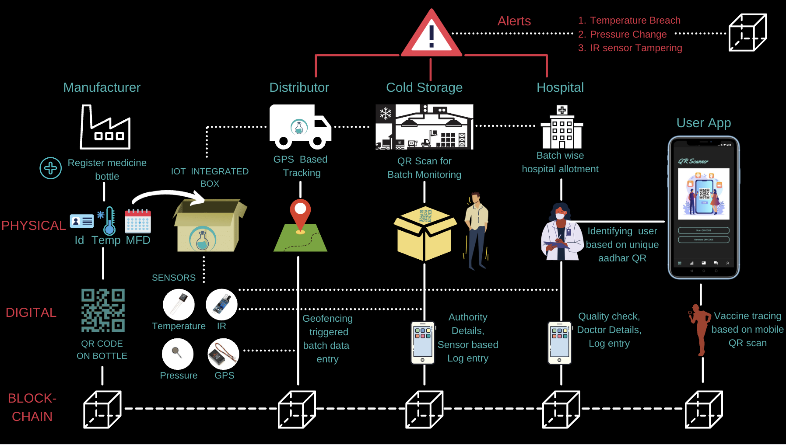

### Increase vaccine adoption through Gamification
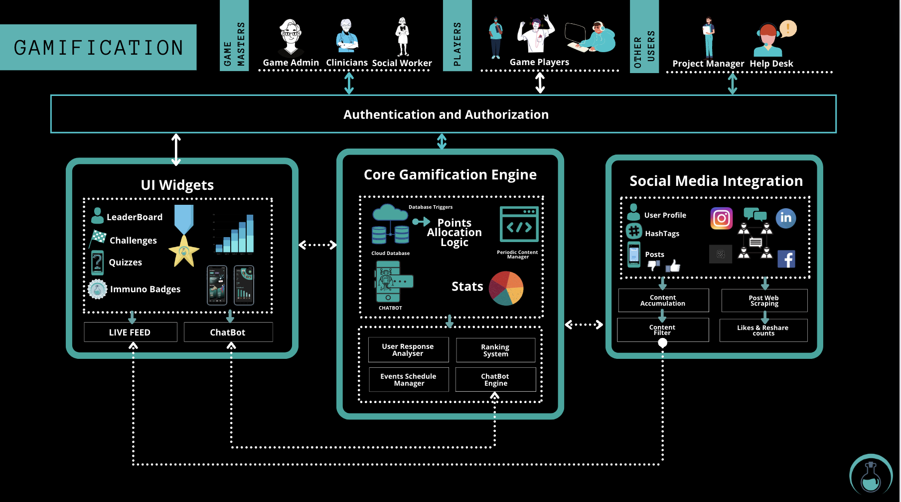

### Features of the Smartphone App

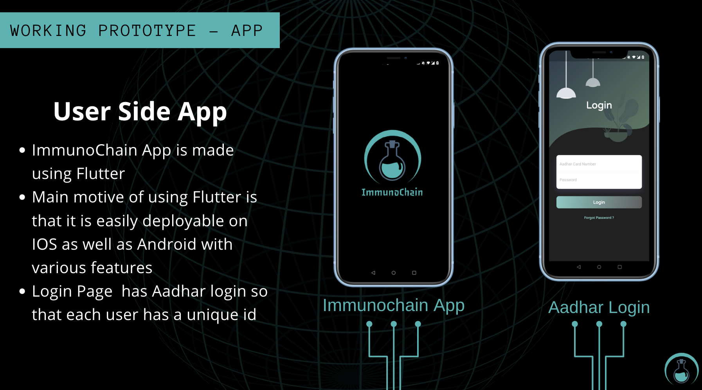

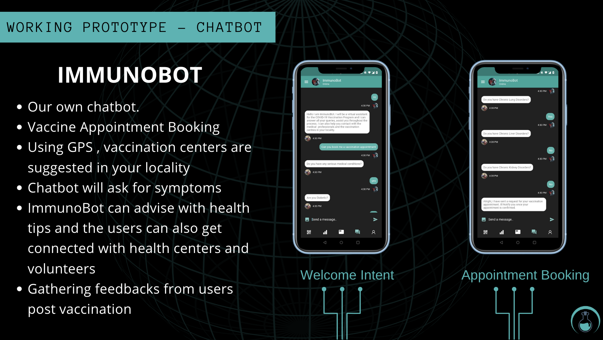

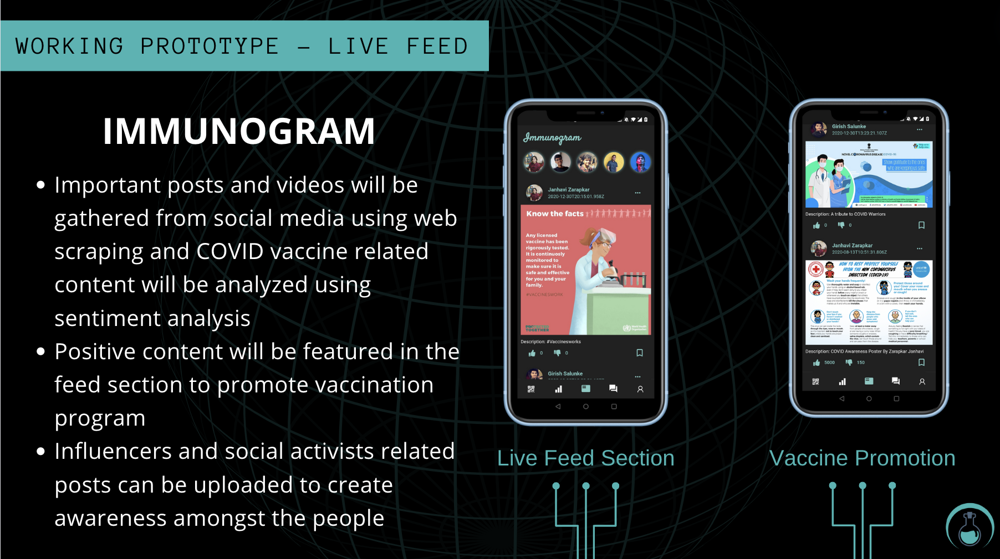

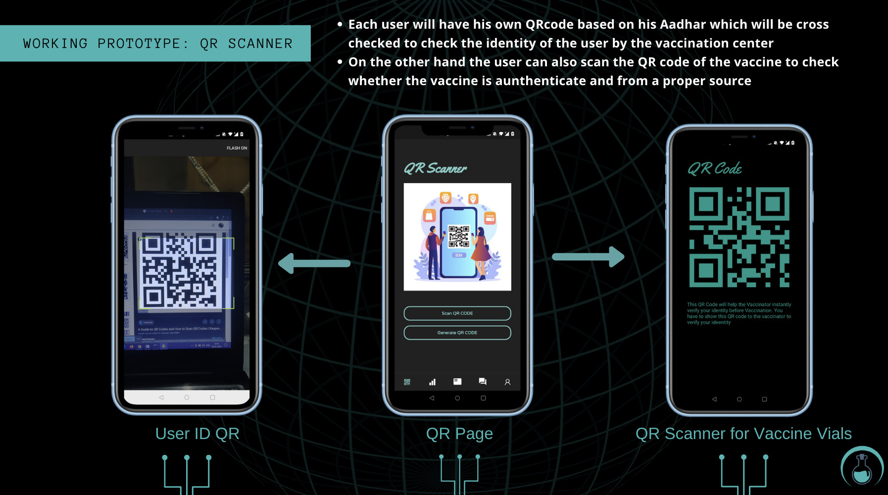

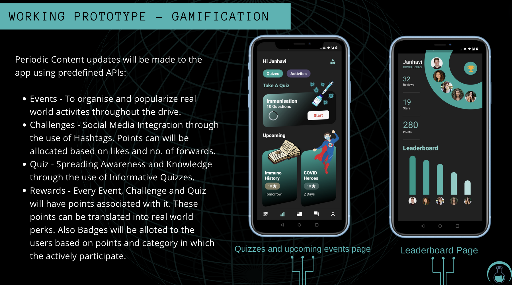

# Features of Monitoring Portal

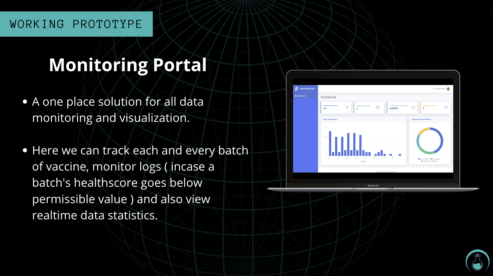

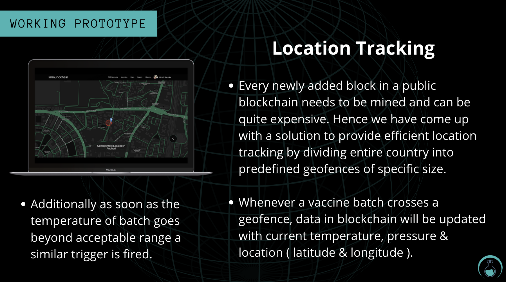

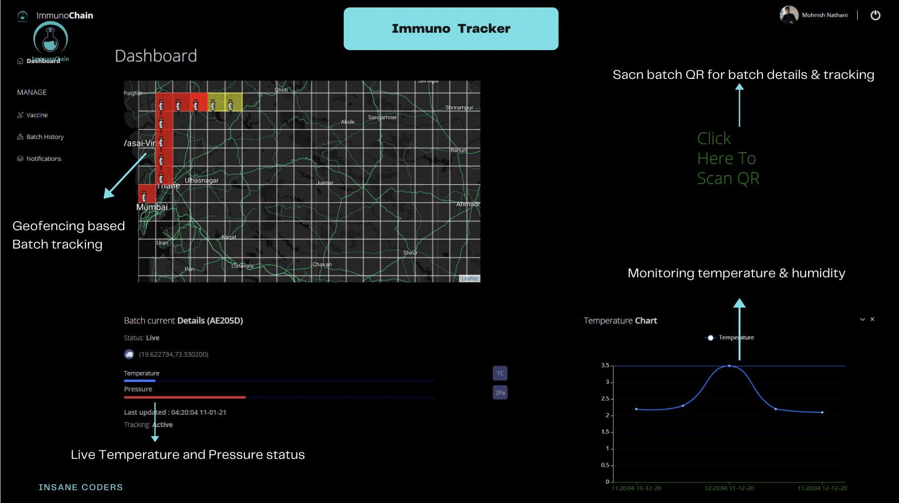

## Technology Stack
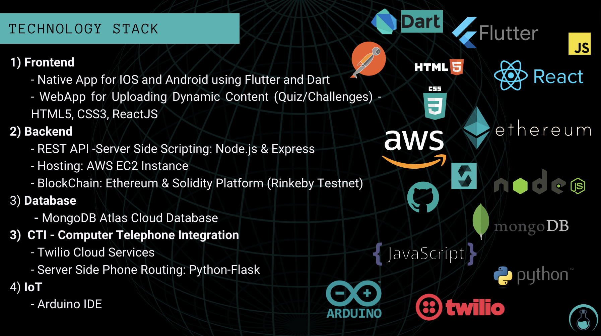

